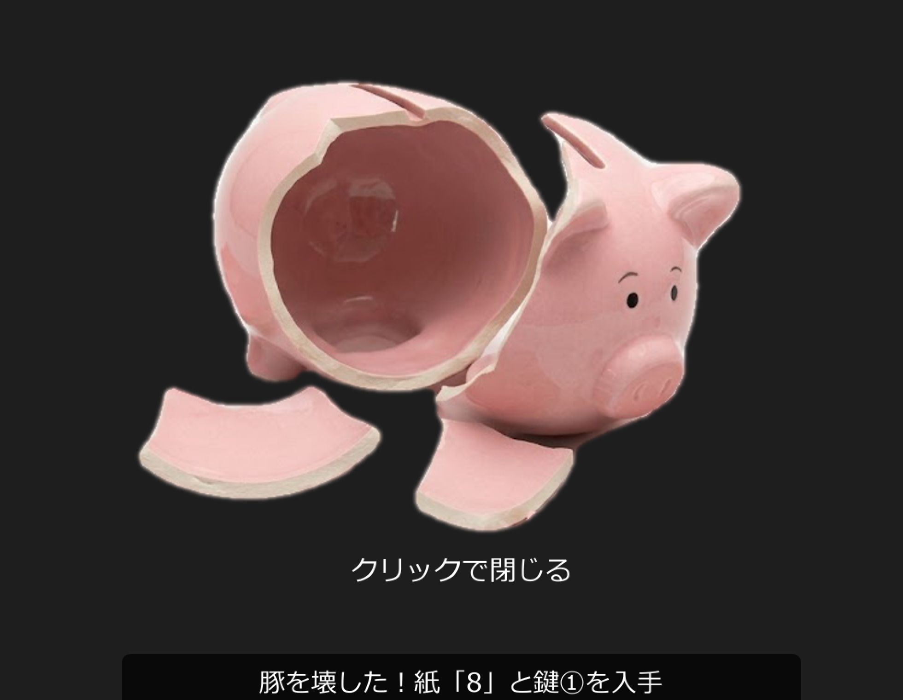
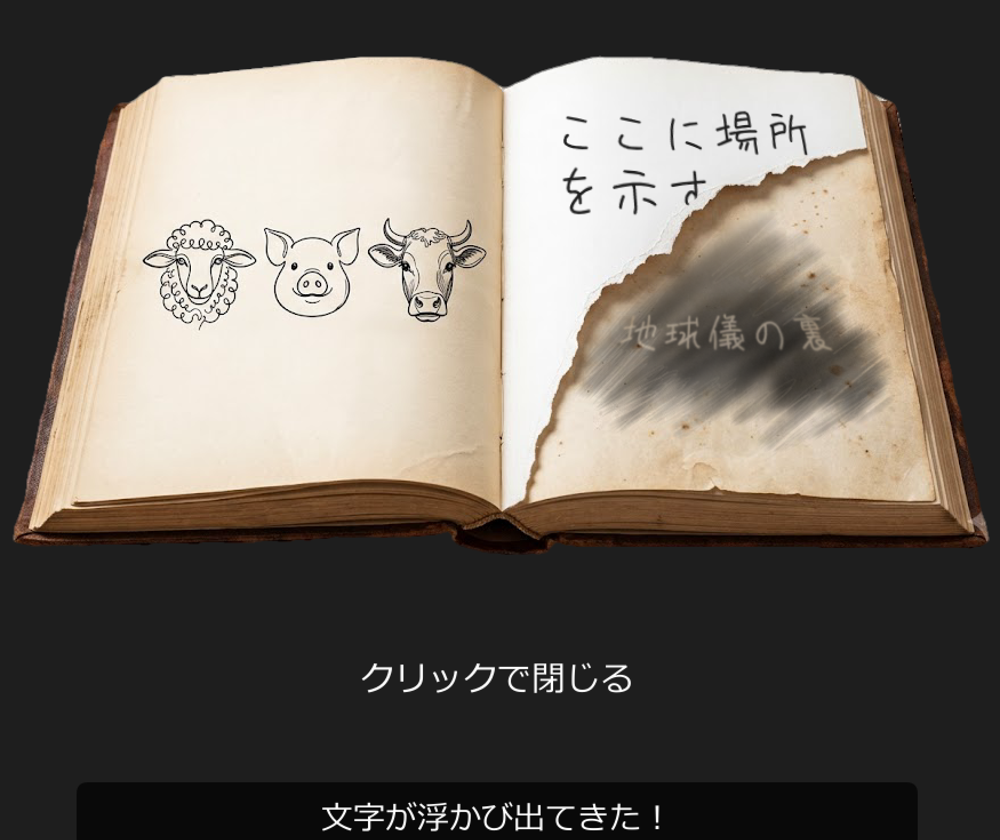

# team12

## ソフトウェア工学Ⅱ チーム開発

### メンバー
- Ryogo Sugi
- Ando Shinnosuke
- Rin Muraguchi
- Ryo Takemoto

## アプリ名
謎解き脱出ゲーム

## アプリ概要
本ゲームは、部屋に隠されたアイテムやヒントを探し、謎を解きながら脱出を目指す脱出ゲームです。

マウスクリックで家具やアイテムを調べ、手に入れたアイテムを活用して部屋からの脱出を目指します。

## 操作方法
左クリック：家具やアイテムを調べる

アイテムをクリック：使用するアイテムを選択

黄色い枠：現在選択中のアイテム

## ゲームの進め方
ゲームを開始すると（app.pdeを開く）、このような部屋の画面が出てきます。この部屋を脱出します。

  

<b>① 本を調べる</b>

  

まず、部屋中央の机に置かれた本をクリックします。

すると、本の中に羊・豚・牛のイラストが表示されます。

<b>② 絵画を調べる</b>

次に、部屋の左側と右奥に飾られている絵画をクリックすると、拡大表示されます。

  
  

本に描かれていた、羊・豚・牛の数をそれぞれ数えます（2枚の絵画の数を合計します）。

<b>③ 3桁の暗証番号を入力する</b>

数えた動物の数をもとに、右奥のタンスにある3桁のダイヤルへ数字を入力します。

正しい数字を入力するとロックが解除され、アイテム「孫の手」を入手できます。

<b>④ 孫の手を使ってアイテムを探す</b>

孫の手を選択すると、アイテム欄の枠が黄色になります。

この状態で、「ソファの下」「右前の棚の下」を調べると、それぞれ「紙」を入手できます。

※孫の手を使わずに調べると、「奥に何かあるようだが手が届かない・・・」というメッセージが表示され、紙を取ることはできません。

<b>⑤ ハンマーを入手する</b>

右奥のタンス下段の引き出しからハンマーを入手できます。

このアイテムはゲーム開始後すぐに取得できます。

<b>⑥ 豚の貯金箱を壊す</b>

ハンマーを選択した状態で、左側の本棚にある豚の貯金箱をクリックします。

貯金箱が壊れ、中からアイテム「鍵1」を入手できます。

  

<b>⑦ 鍵付きの棚を開ける</b>

鍵1を選択した状態で、右側の鍵付き棚をクリックします。

中から、アイテム「えんぴつ」と「紙」を入手できます。

<b>⑧ 本に書き込みをする</b>

えんぴつを選択した状態で、もう一度机の本を調べます。

すると、

「地球儀の裏」

という新たなメッセージが浮かび上がってきます。

  

<b>⑨ 最後の紙を見つける</b>

ヒントに従い、本棚にある地球儀をクリックすると、最後の「紙」を入手できます。

<b>⑩ 4枚の紙から暗証番号を導く</b>

集めた4枚の紙を、破れた形を手掛かりに正しい順番へ並べます。

完成した数字が、金庫の4桁の暗証番号になります。

<b>⑪ 金庫を開ける</b>

導き出した4桁の数字を金庫へ入力します。

正解すると金庫が開き、アイテム「鍵2」を入手できます。

<b>⑫ 扉を開ける</b>

最後に鍵2を使用して扉を開けます。

扉が開けばゲームクリア（脱出成功）です。

