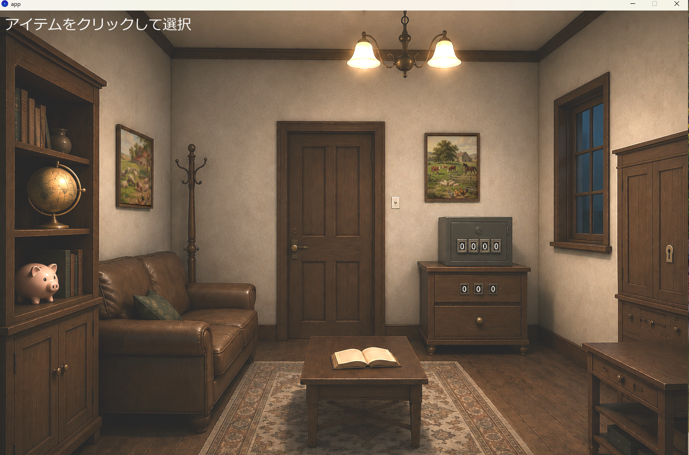
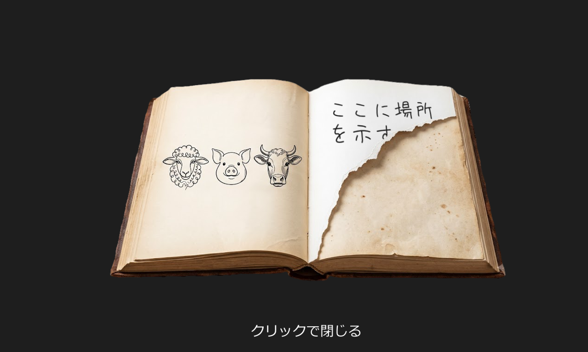

# team12

## ソフトウェア工学Ⅱ チーム開発

### メンバー
- Ryogo Sugi
- Ando Shinnosuke
- Rin Muraguchi
- Ryo Takemoto

## アプリ名
謎解き脱出ゲーム

## アプリ概要
本ゲームは、部屋に隠されたアイテムやヒントを探し、謎を解きながら脱出を目指す脱出ゲームです。
マウスクリックで家具やアイテムを調べ、手に入れたアイテムを活用して部屋からの脱出を目指します。

## 操作方法
左クリック：家具やアイテムを調べる
アイテムをクリック：使用するアイテムを選択
黄色い枠：現在選択中のアイテム

## ゲームの進め方
ゲームを開始すると（app.pdeを開く）、このような部屋の画面が出てきます。この部屋を脱出します。

  

①本を調べる

  

まず、部屋中央の机に置かれた本をクリックします。
すると、本の中に羊・豚・牛のイラストが表示されます。

② 絵画を調べる
次に、部屋の左側と右奥に飾られている絵画をクリックすると、拡大表示されます。
本に描かれていた、羊・豚・牛の数をそれぞれ数えます（2枚の絵画の数を合計します）。

③ 3桁の暗証番号を入力する
数えた動物の数をもとに、右奥のタンスにある3桁のダイヤルへ数字を入力します。
正しい数字を入力するとロックが解除され、**「孫の手」**を入手できます。

④ 孫の手を使ってアイテムを探す

孫の手を選択すると、アイテム欄の枠が黄色になります。

この状態で

ソファの下
右前の棚の下

を調べると、それぞれ紙を入手できます。

※孫の手を使わずに調べると、「手が届かない」というメッセージが表示され、紙を取ることはできません。

⑤ ハンマーを入手する

右奥のタンス下段の引き出しからハンマーを入手できます。

このアイテムはゲーム開始後すぐに取得できます。

⑥ 豚の貯金箱を壊す

ハンマーを選択した状態で、左側の本棚にある豚の貯金箱をクリックします。

貯金箱が壊れ、中から**「鍵1」**を入手できます。

⑦ 鍵付きの棚を開ける

鍵1を選択した状態で、右側の鍵付き棚をクリックします。

中から

えんぴつ
紙

を入手できます。

⑧ 本に書き込みをする

えんぴつを選択した状態で、もう一度机の本を調べます。

すると、

「地球儀の裏を見ろ」

という新たなメッセージが現れます。

⑨ 最後の紙を見つける

ヒントに従い、本棚にある地球儀をクリックすると、最後の紙を入手できます。

⑩ 4枚の紙から暗証番号を導く

集めた4枚の紙を、破れた形を手掛かりに正しい順番へ並べます。

完成した数字が、金庫の4桁の暗証番号になります。

⑪ 金庫を開ける

導き出した4桁の数字を金庫へ入力します。

正解すると金庫が開き、**「鍵2」**を入手できます。

⑫ 扉を開ける

最後に鍵2を使用して扉を開けます。

扉が開けばゲームクリアです。

おめでとうございます！
